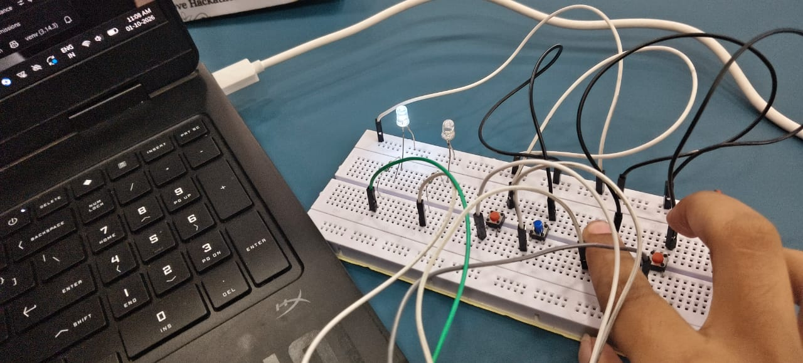

# 🚦 Smart Hybrid Traffic Priority System
> A hybrid IoT and Computer Vision solution built during the **Smart Move Hackathon** to reduce emergency vehicle response times.



---

## 💡 About The Project
Traffic congestion frequently delays emergency vehicles like ambulances, costing critical lives. This project introduces a smart hybrid traffic priority system that combines physical embedded hardware with intelligent real-time monitoring to automatically clear paths for emergency transport.

---

## 🛠️ Tech Stack & Architecture
* **Firmware:** ESP32 Microcontroller, C++, Arduino IDE (Active-Low LED logic, manual overrides, and state machines).
* **Dashboard & Vision:** Python, Streamlit, OpenCV.
* **Tools & Version Control:** Git, GitHub.

---

## 📂 Repository Structure
```text
traffic/
├── firmware/         # C++ source code for the ESP32 microcontroller
├── dashboard/        # Python/Streamlit app, OpenCV scripts, and requirements
├── docs/             # Hardware photos, wiring guides, and project assets
└── .gitignore        # Excluded unnecessary system/venv files